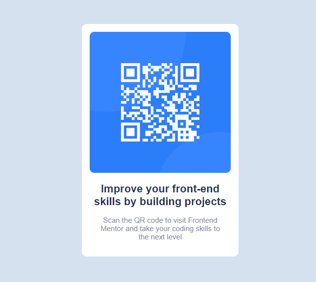

# Frontend Mentor - QR code component solution

This is a solution to the [QR code component challenge on Frontend Mentor](https://www.frontendmentor.io/challenges/qr-code-component-iux_sIO_H). Frontend Mentor challenges help you improve your coding skills by building realistic projects. 

## Table of contents

- [Overview](#overview)
  - [Screenshot](#screenshot)
  - [Links](#links)
- [My process](#my-process)
  - [Built with](#built-with)
  - [What I learned](#what-i-learned)

## Overview

### Screenshot

### Links

- Live Site URL: [QR code component challenge](https://vinhtran144.github.io/QR-frontend/?fbclid=IwAR3MgqZyZC7o_RoeKzyQdJWCwIfu0y4MWs5KSp9fOYQDskz-2r5GDYGVYMk)

## My process

### Built with

- stylus

### What I learned

This is my first time working with a css code preprocessor. Stylus workflow is simple to learn and very logical; therefore, I'm looking forward to using it more in future projects.